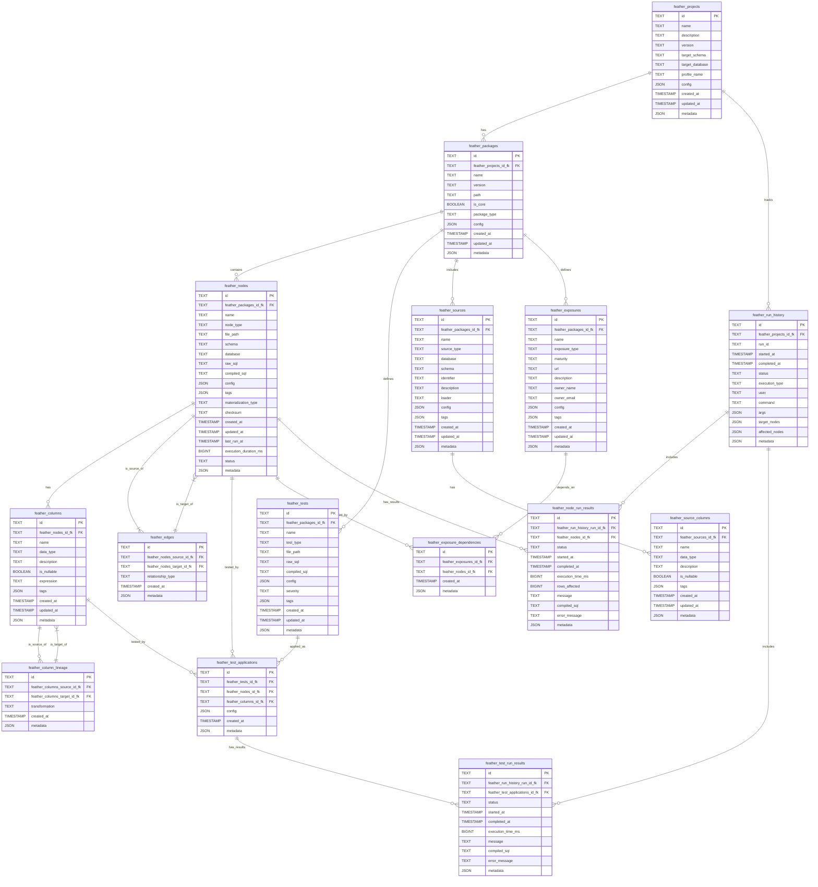

-- Projects table
CREATE TABLE feather_projects (
    id TEXT PRIMARY KEY,
    name TEXT NOT NULL,
    description TEXT,
    version TEXT NOT NULL,
    target_schema TEXT NOT NULL,
    target_database TEXT,
    profile_name TEXT NOT NULL,
    config JSON NOT NULL,
    created_at TIMESTAMP NOT NULL,
    updated_at TIMESTAMP NOT NULL,
    metadata JSON NOT NULL DEFAULT '{}'
);

-- Packages table 
CREATE TABLE feather_packages (
    id TEXT PRIMARY KEY,
    feather_projects_id_fk TEXT NOT NULL,
    name TEXT NOT NULL,
    version TEXT NOT NULL,
    path TEXT NOT NULL,
    is_core BOOLEAN NOT NULL,
    package_type TEXT NOT NULL,
    config JSON NOT NULL,
    created_at TIMESTAMP NOT NULL,
    updated_at TIMESTAMP NOT NULL,
    metadata JSON NOT NULL DEFAULT '{}',
    FOREIGN KEY (feather_projects_id_fk) REFERENCES feather_projects(id),
    UNIQUE (feather_projects_id_fk, name)
);

-- Nodes table
CREATE TABLE feather_nodes (
    id TEXT PRIMARY KEY,
    feather_packages_id_fk TEXT NOT NULL,
    name TEXT NOT NULL,
    node_type TEXT NOT NULL,
    file_path TEXT NOT NULL,
    schema TEXT NOT NULL,
    database TEXT,
    raw_sql TEXT NOT NULL,
    compiled_sql TEXT,
    config JSON NOT NULL,
    tags JSON NOT NULL,
    materialization_type TEXT NOT NULL,
    checksum TEXT NOT NULL,
    created_at TIMESTAMP NOT NULL,
    updated_at TIMESTAMP NOT NULL,
    last_run_at TIMESTAMP,
    execution_duration_ms BIGINT,
    status TEXT NOT NULL,
    metadata JSON NOT NULL DEFAULT '{}',
    FOREIGN KEY (feather_packages_id_fk) REFERENCES feather_packages(id),
    UNIQUE (feather_packages_id_fk, name)
);

-- Edges table
CREATE TABLE feather_edges (
    id TEXT PRIMARY KEY,
    feather_nodes_source_id_fk TEXT NOT NULL,
    feather_nodes_target_id_fk TEXT NOT NULL,
    relationship_type TEXT NOT NULL,
    created_at TIMESTAMP NOT NULL,
    metadata JSON NOT NULL DEFAULT '{}',
    FOREIGN KEY (feather_nodes_source_id_fk) REFERENCES feather_nodes(id),
    FOREIGN KEY (feather_nodes_target_id_fk) REFERENCES feather_nodes(id),
    UNIQUE (feather_nodes_source_id_fk, feather_nodes_target_id_fk, relationship_type)
);

-- Columns table
CREATE TABLE feather_columns (
    id TEXT PRIMARY KEY,
    feather_nodes_id_fk TEXT NOT NULL,
    name TEXT NOT NULL,
    data_type TEXT NOT NULL,
    description TEXT,
    is_nullable BOOLEAN NOT NULL,
    expression TEXT,
    tags JSON NOT NULL,
    created_at TIMESTAMP NOT NULL,
    updated_at TIMESTAMP NOT NULL,
    metadata JSON NOT NULL DEFAULT '{}',
    FOREIGN KEY (feather_nodes_id_fk) REFERENCES feather_nodes(id),
    UNIQUE (feather_nodes_id_fk, name)
);

-- Column Lineage table
CREATE TABLE feather_column_lineage (
    id TEXT PRIMARY KEY,
    feather_columns_source_id_fk TEXT NOT NULL,
    feather_columns_target_id_fk TEXT NOT NULL,
    transformation TEXT,
    created_at TIMESTAMP NOT NULL,
    metadata JSON NOT NULL DEFAULT '{}',
    FOREIGN KEY (feather_columns_source_id_fk) REFERENCES feather_columns(id),
    FOREIGN KEY (feather_columns_target_id_fk) REFERENCES feather_columns(id),
    UNIQUE (feather_columns_source_id_fk, feather_columns_target_id_fk)
);

-- Tests table
CREATE TABLE feather_tests (
    id TEXT PRIMARY KEY,
    feather_packages_id_fk TEXT NOT NULL,
    name TEXT NOT NULL,
    test_type TEXT NOT NULL,
    file_path TEXT NOT NULL,
    raw_sql TEXT NOT NULL,
    compiled_sql TEXT,
    config JSON NOT NULL,
    severity TEXT NOT NULL DEFAULT 'error',
    tags JSON NOT NULL,
    created_at TIMESTAMP NOT NULL,
    updated_at TIMESTAMP NOT NULL,
    metadata JSON NOT NULL DEFAULT '{}',
    FOREIGN KEY (feather_packages_id_fk) REFERENCES feather_packages(id),
    UNIQUE (feather_packages_id_fk, name)
);

-- Test Applications table
CREATE TABLE feather_test_applications (
    id TEXT PRIMARY KEY,
    feather_tests_id_fk TEXT NOT NULL,
    feather_nodes_id_fk TEXT,
    feather_columns_id_fk TEXT,
    config JSON NOT NULL,
    created_at TIMESTAMP NOT NULL,
    metadata JSON NOT NULL DEFAULT '{}',
    FOREIGN KEY (feather_tests_id_fk) REFERENCES feather_tests(id),
    FOREIGN KEY (feather_nodes_id_fk) REFERENCES feather_nodes(id),
    FOREIGN KEY (feather_columns_id_fk) REFERENCES feather_columns(id),
    CHECK ((feather_nodes_id_fk IS NULL) != (feather_columns_id_fk IS NULL))
);

-- Sources table
CREATE TABLE feather_sources {
    id TEXT PRIMARY KEY,
    feather_packages_id_fk TEXT NOT NULL,
    name TEXT NOT NULL,
    source_type TEXT NOT NULL,
    database TEXT,
    schema TEXT NOT NULL,
    identifier TEXT NOT NULL,
    description TEXT,
    loader TEXT NOT NULL,
    config JSON NOT NULL,
    tags JSON NOT NULL,
    created_at TIMESTAMP NOT NULL,
    updated_at TIMESTAMP NOT NULL,
    metadata JSON NOT NULL DEFAULT '{}',
    FOREIGN KEY (feather_packages_id_fk) REFERENCES feather_packages(id),
    UNIQUE (feather_packages_id_fk, name)
);

-- Source Columns table
CREATE TABLE feather_source_columns {
    id TEXT PRIMARY KEY,
    feather_sources_id_fk TEXT NOT NULL,
    name TEXT NOT NULL,
    data_type TEXT NOT NULL,
    description TEXT,
    is_nullable BOOLEAN NOT NULL,
    tags JSON NOT NULL,
    created_at TIMESTAMP NOT NULL,
    updated_at TIMESTAMP NOT NULL,
    metadata JSON NOT NULL DEFAULT '{}',
    FOREIGN KEY (feather_sources_id_fk) REFERENCES feather_sources(id),
    UNIQUE (feather_sources_id_fk, name)
);

-- Exposures table
CREATE TABLE feather_exposures {
    id TEXT PRIMARY KEY,
    feather_packages_id_fk TEXT NOT NULL,
    name TEXT NOT NULL,
    exposure_type TEXT NOT NULL,
    maturity TEXT,
    url TEXT,
    description TEXT,
    owner_name TEXT,
    owner_email TEXT,
    config JSON NOT NULL,
    tags JSON NOT NULL,
    created_at TIMESTAMP NOT NULL,
    updated_at TIMESTAMP NOT NULL,
    metadata JSON NOT NULL DEFAULT '{}',
    FOREIGN KEY (feather_packages_id_fk) REFERENCES feather_packages(id),
    UNIQUE (feather_packages_id_fk, name)
};

-- Exposure Dependencies table
CREATE TABLE feather_exposure_dependencies {
    id TEXT PRIMARY KEY,
    feather_exposures_id_fk TEXT NOT NULL,
    feather_nodes_id_fk TEXT NOT NULL,
    created_at TIMESTAMP NOT NULL,
    metadata JSON NOT NULL DEFAULT '{}',
    FOREIGN KEY (feather_exposures_id_fk) REFERENCES feather_exposures(id),
    FOREIGN KEY (feather_nodes_id_fk) REFERENCES feather_nodes(id),
    UNIQUE (feather_exposures_id_fk, feather_nodes_id_fk)
};

-- Run History table
CREATE TABLE feather_run_history {
    id TEXT PRIMARY KEY,
    feather_projects_id_fk TEXT NOT NULL,
    run_id TEXT NOT NULL,
    started_at TIMESTAMP NOT NULL,
    completed_at TIMESTAMP,
    status TEXT NOT NULL,
    execution_type TEXT NOT NULL,
    user TEXT,
    command TEXT NOT NULL,
    args JSON NOT NULL,
    target_nodes JSON,
    affected_nodes JSON,
    metadata JSON NOT NULL DEFAULT '{}',
    FOREIGN KEY (feather_projects_id_fk) REFERENCES feather_projects(id)
};

-- Node Run Results table
CREATE TABLE feather_node_run_results {
    id TEXT PRIMARY KEY,
    feather_run_history_run_id_fk TEXT NOT NULL,
    feather_nodes_id_fk TEXT NOT NULL,
    status TEXT NOT NULL,
    started_at TIMESTAMP NOT NULL,
    completed_at TIMESTAMP,
    execution_time_ms BIGINT,
    rows_affected BIGINT,
    message TEXT,
    compiled_sql TEXT,
    error_message TEXT,
    metadata JSON NOT NULL DEFAULT '{}',
    FOREIGN KEY (feather_run_history_run_id_fk) REFERENCES feather_run_history(run_id),
    FOREIGN KEY (feather_nodes_id_fk) REFERENCES feather_nodes(id)
};

-- Test Run Results table
CREATE TABLE feather_test_run_results {
    id TEXT PRIMARY KEY,
    feather_run_history_run_id_fk TEXT NOT NULL,
    feather_test_applications_id_fk TEXT NOT NULL,
    status TEXT NOT NULL,
    started_at TIMESTAMP NOT NULL,
    completed_at TIMESTAMP,
    execution_time_ms BIGINT,
    message TEXT,
    compiled_sql TEXT,
    error_message TEXT,
    metadata JSON NOT NULL DEFAULT '{}',
    FOREIGN KEY (feather_run_history_run_id_fk) REFERENCES feather_run_history(run_id),
    FOREIGN KEY (feather_test_applications_id_fk) REFERENCES feather_test_applications(id)
};

