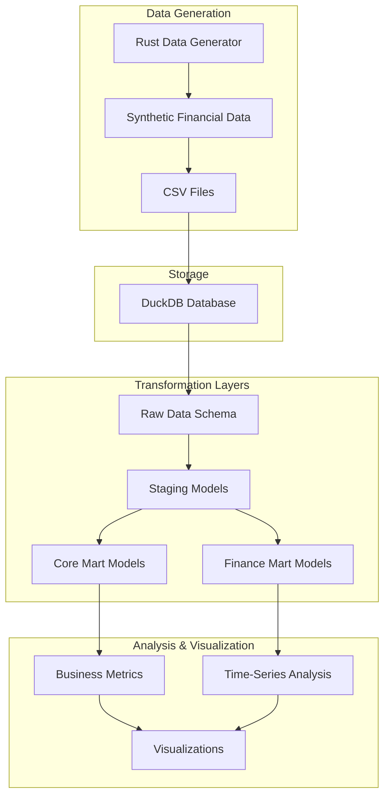
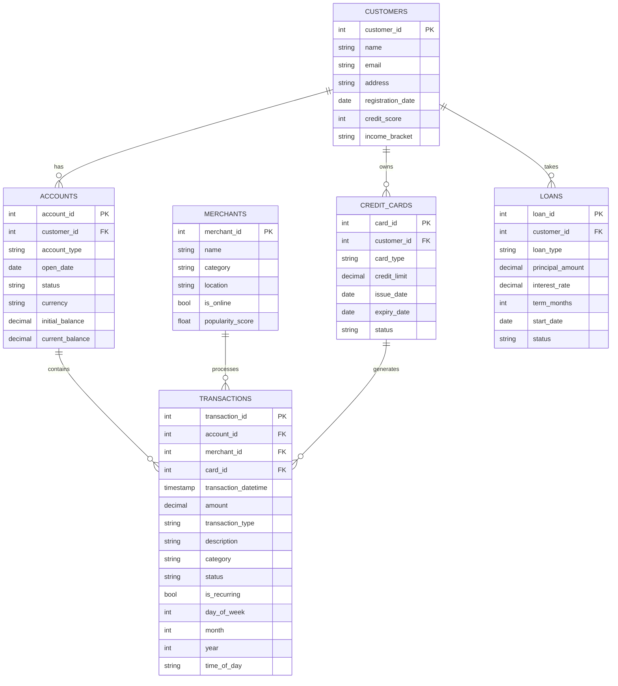
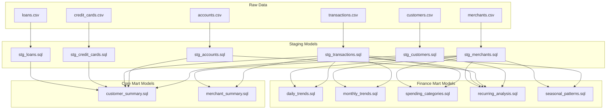
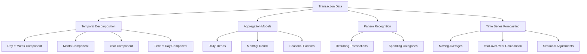
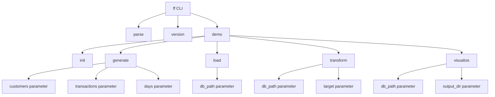
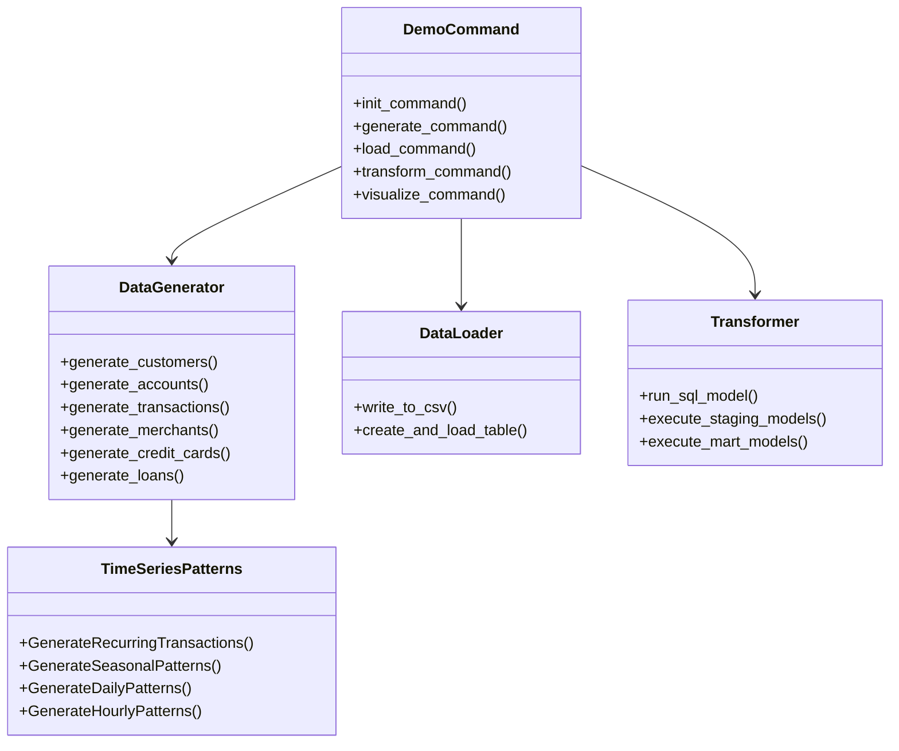

# FeatherFlow Financial Demo Architecture

This document provides an architectural overview of the FeatherFlow Financial Demo, focusing on data flow, transformation layers, and time-series analysis capabilities.

## System Architecture

The FeatherFlow Financial Demo consists of several connected components that work together to generate, store, transform, and analyze financial data.

## Data Flow

The data flows through the system as follows:

1. **Generation**: The Rust-based data generator creates synthetic financial data with time-series patterns
2. **Storage**: Data is written to CSV files and loaded into a DuckDB database
3. **Staging**: Raw data is cleaned and standardized in the staging layer
4. **Transformation**: Staging data is transformed into business-level metrics and time-series analytics
5. **Analysis**: Transformed data is used for business insights and visualization

## Data Model

The financial demo uses a star schema centered around transaction data:

## Transformation Architecture

The transformation process follows a layered approach:

## Time-Series Analysis Architecture

The time-series analysis capabilities include:

## CLI Command Structure

The FeatherFlow CLI is extended with the demo subcommand:

## Implementation Components

The implementation consists of these main components:

## Time-Series Features

The time-series features of the financial demo include:

### 1. Temporal Decomposition

Each transaction is decomposed into temporal components:
- Year
- Month
- Day of month
- Day of week
- Time of day
- Season

### 2. Recurring Pattern Generation

The data generator simulates realistic recurring patterns:
- Biweekly or monthly income deposits
- Monthly bill payments on consistent dates
- Weekly recurring expenses (e.g., groceries)
- Subscriptions with fixed intervals

### 3. Seasonal Patterns

Spending patterns vary by season:
- Holiday shopping in winter
- Travel expenses in summer
- Back-to-school spending in fall

### 4. Year-over-Year Analysis

Models include comparison of metrics across years:
- Spending growth rates
- Category shifts
- Merchant popularity changes

### 5. Moving Averages and Trends

Analysis includes trend detection:
- 3-month rolling averages
- 6-month rolling averages
- Month-over-month growth rates
- Linear trend projections

### 6. Time-Based Forecasting

Basic forecasting techniques:
- Weighted moving averages
- Seasonal adjustments
- Year-over-year extrapolation

## Conclusion

The FeatherFlow Financial Demo architecture provides a comprehensive framework for generating, transforming, and analyzing time-series financial data. The layered approach to transformations allows for clear separation of concerns, while the integrated time-series components enable sophisticated financial analysis.

This architecture can be extended with additional features such as:
1. Anomaly detection for fraud identification
2. Advanced forecasting models
3. Interactive dashboards
4. Portfolio optimization
5. Risk modeling