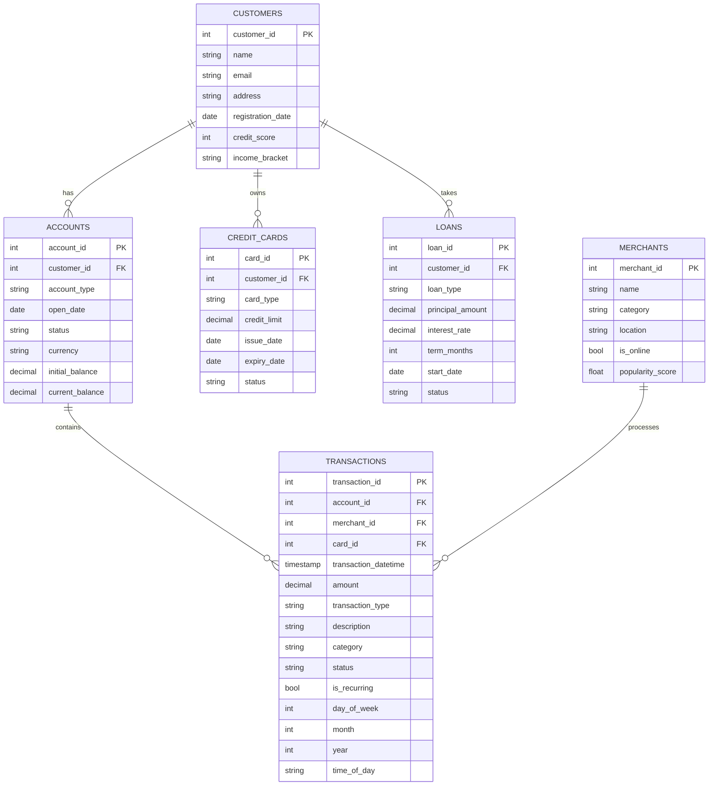

# FeatherFlow Financial Demo

This demo project showcases FeatherFlow's capabilities with a synthetic financial dataset featuring time-series data. It demonstrates how FeatherFlow can be used to transform raw financial data into meaningful analytics and insights.

## Overview

The FeatherFlow Financial Demo generates a deterministic synthetic dataset that simulates:
- Customer profiles with varying credit scores and income brackets
- Bank accounts with transaction histories
- Credit cards and loan accounts
- Time-series transaction data with realistic patterns
- Merchant data categorized by industry

The demo showcases FeatherFlow's ability to:
- Parse and transform complex financial data
- Build dependencies between different data models
- Create insightful business metrics from raw transaction data
- Analyze time-series patterns in financial data

## Data Model

The demo uses the following data model:



## Time-Series Features

The transaction data includes rich time-series features:

- **Full transaction history**: Typically 2 years of historical data
- **Temporal patterns**:
  - Day-of-week patterns (weekday vs weekend spending)
  - Monthly patterns (seasonal spending, month-end bill payments)
  - Yearly patterns (holiday spending, annual subscriptions)
  - Time-of-day patterns (morning coffee, lunch expenses, evening entertainment)
- **Recurring transactions**: Flagged for easy identification of regular bills and subscriptions
- **Trend analysis**: Support for time-based aggregations and year-over-year comparisons

## Getting Started

To use the financial demo:

1. Install FeatherFlow according to the main project instructions
2. Run the demo initialization:
   ```bash
   cargo run --bin ff -- demo init
   ```
3. Generate the synthetic dataset:
   ```bash
   cargo run --bin ff -- demo generate
   ```
4. Load the data into DuckDB:
   ```bash
   cargo run --bin ff -- demo load
   ```
5. Run the transformations:
   ```bash
   cargo run --bin ff -- demo transform
   ```

## Example Insights

The demo's transformations enable insights such as:

- **Customer Financial Summary**: Total balances, spending habits, credit utilization
- **Spending Patterns**: Category-based analysis of where money is spent
- **Monthly Trends**: Month-over-month and year-over-year spending comparisons
- **Recurring Expense Analysis**: Identification of subscriptions and regular bills
- **Merchant Analysis**: Which merchants are most frequently used by customers
- **Time-Series Patterns**: Day-of-week effects, seasonal trends, and growth analysis

## Customization

You can customize the data generation:

```bash
# Generate data with 200 customers, approximately 1000 transactions per account, over 365 days
cargo run --bin ff -- demo generate --customers 200 --transactions 1000 --days 365
```

## Extending the Demo

This demo can be extended in various ways:

1. Add more complex financial instruments (investments, mortgages)
2. Implement fraud detection models
3. Add more sophisticated time-series analysis
4. Create visualizations of spending patterns
5. Build customer segmentation models

Refer to the `IMPLEMENTATION_PLAN.md` file for detailed technical specifications of this demo.